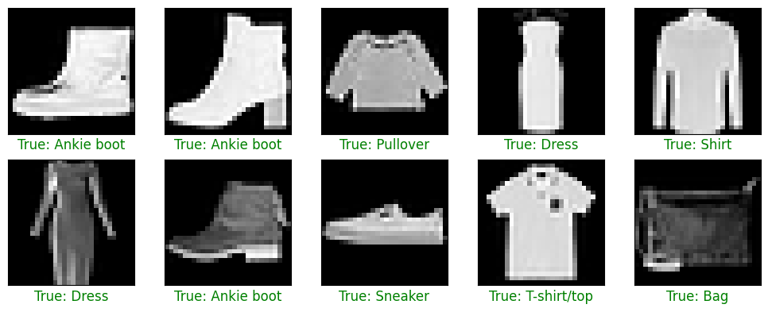
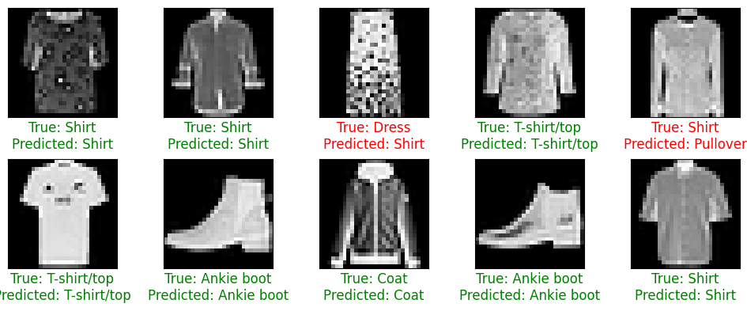
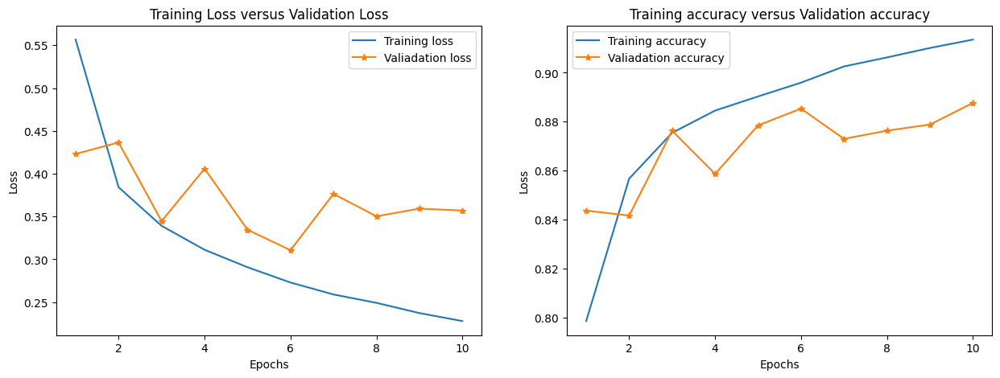

# Building Artificial Neural Network With Keras

This project was created to help me learning about deep learning model, how to create a neural network, in this project I'm using keras, It has a high user-interface and it's kind of easy to understand, you can explain it just by interpret the code, where to define model, then compile and fit it, those needed params, I made this project by follow the CodeXplore Channel on Youtube, and it really help me out to understand how the neural network learn and predict after all.

## This is some visualization on my notebook

### This is some ramdom sample in Mnist dataset

### This is the prediction of model in Mnist test dataset

### The progress of the model when it was training

Last but not least, To use my notebook you just to open it in google colab for real quick. that's funny.
